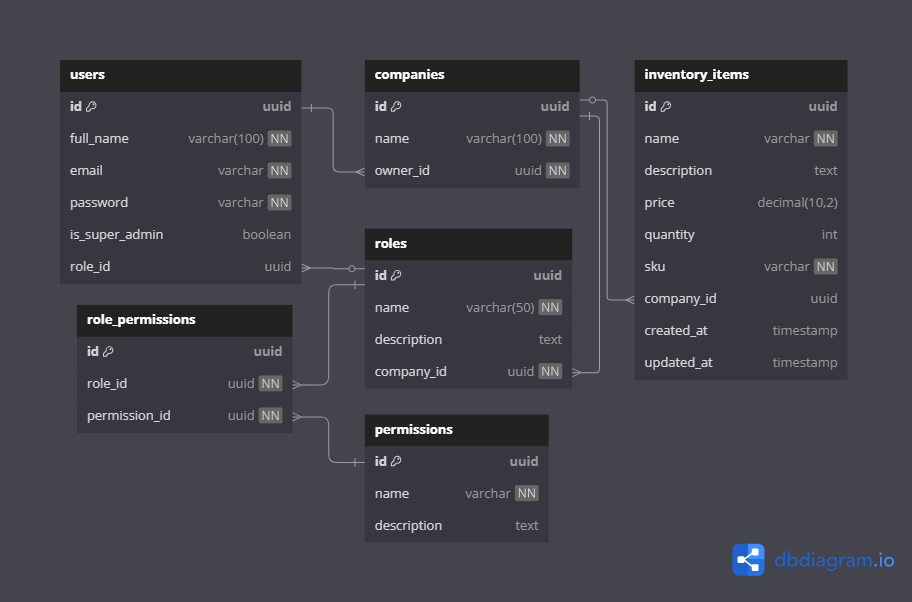

# Project X: Multi-User Inventory and Checkout Software

Project X is a SaaS software that helps marketplace enterprises to handle checkout with a multi-user functionality allowing every department to access and update inventory without delay.

## Features

- Multi-user system with role-based access control
- User management for super admin (business owner)
- Authentication and authorization mechanisms
- Inventory management and checkout functionality

## Technology Stack

- **Backend**: Node.js, Express, TypeScript
- **Database**: PostgreSQL
- **ORM**: TypeORM
- **Authentication**: JWT (JSON Web Tokens)
- **Input Validation**: Joi
- **Password Encryption**: bcrypt


## Database Schema

The system uses the following entities:

- **Users**: Stores user information including authentication details
- **Companies**: Represents businesses using the system
- **InventoryItems**: Represents inventory available in the system
- **Roles**: Defines user roles within a company
- **Permissions**: Lists available permissions in the system
- **RolePermissions**: Junction table linking roles to their permissions

## ERD

🔗 [ERD on dbDiagram](https://dbdiagram.io/d/Projext-X-681b23085b2fc4582f90ce8a)




## Prerequisites

- Node.js (v16 or later)
- PostgreSQL (v14 or later)
- npm or yarn


## Installation

1. Clone the repository:
   ```
   git clone https://github.com/aphatheology/ProjectX.git
   cd ProjectX
   ```

2. Install dependencies:
   ```
   yarn install
   ```

3. Create a `.env` file based on `.env.example` and update the values:
   ```
   cp .envExample .env
   ```

4. Create a PostgreSQL database named `project_x`

5. Build the application:
   ```
   yarn run build
   ```

6. Start the server:
   ```
   yarn run start
   ```

7. For development mode with hot-reload:
   ```
   yarn run dev
   ```


## API Documentation

For full details on endpoints, request/response schemas, and examples, view our Postman collection:

🔗 [Postman API Docs](https://documenter.getpostman.com/view/13406320/2sB2j7eVRn)

### Authentication Endpoints

#### Register Super Admin

```http
POST /v1/api/auth/register
```

Register a new super admin (business owner) with the capability to manage the entire system.

**Request Body:**
```json
{
  "fullName": "John Doe",
  "companyName": "Shoprite",
  "email": "john.doe@example.com",
  "password": "SecurePassword123"
}
```

**Response:**
```json
{
  "message": "Super admin registered successfully",
  "user": {
    "id": "uuid",
    "fullName": "John Doe",
    "email": "john.doe@example.com",
    "isSuperAdmin": true,
    "roleId": "uuid"
  },
  "accessToken": "jwt-token"
}
```

#### Create User (by Super Admin)

```http
POST /v1/api/auth/users
```

Super admin can create new users and assign them to roles.

**Headers:**
```
Authorization: Bearer <jwt_token>
```

**Request Body:**
```json
{
  "fullName": "Jane Smith",
  "email": "jane.smith@example.com",
  "roleId": "uuid-of-role"
}
```

**Response:**
```json
{
  "message": "User created successfully",
  "user": {
    "id": "uuid",
    "fullName": "Jane Smith",
    "email": "jane.smith@example.com",
    "isSuperAdmin": false,
    "roleId": "uuid-of-role"
  }
}
```

#### Login

```http
POST /v1/api/auth/login
```

Login endpoint for all user types.

**Request Body:**
```json
{
  "email": "user@example.com",
  "password": "YourPassword123"
}
```

**Response:**
```json
{
  "message": "Login successful",
  "user": {
    "id": "uuid",
    "fullName": "User Name",
    "email": "user@example.com",
    "isSuperAdmin": false,
    "roleId": "uuid-of-role"
  },
  "accessToken": "jwt-token"
}
```

---

### Role & Permission Management

#### Create Role

```http
POST /v1/api/roles
```

Create a new role within your company.

**Headers:**

```
Authorization: Bearer <jwt_token>
Content-Type: application/json
```

**Request Body:**

```json
{
  "name": "Staff",
  "companyId": "7de0f130-42dc-4366-89ec-233029300fff"
}
```

**Response:**

```json
{
  "status": "success",
  "message": "Role created successfully",
  "data": {
    "id": "b2db8ce0-bf66-4df1-abf8-49e825ecbadd",
    "name": "Staff",
    "description": null,
    "companyId": "7de0f130-42dc-4366-89ec-233029300fff"
  }
}
```

#### Get All Roles

```http
GET /v1/api/roles
```

Retrieve every role defined for your company.

**Headers:**

```
Authorization: Bearer <jwt_token>
```

**Response:**

```json
{
  "status": "success",
  "message": "Roles fetched successfully",
  "data": [
    {
      "id": "fa731e50-9e46-4823-b0f7-189aec201ea4",
      "name": "SuperAdmin",
      "description": "Administrator with all permissions",
      "companyId": "7de0f130-42dc-4366-89ec-233029300fff",
      "rolePermissions": [ /* … */ ]
    }
    /* …other roles… */
  ]
}
```

#### Get Permissions for a Role

```http
GET /v1/api/roles/:roleId/permissions
```

List all permissions assigned to a specific role.

**Headers:**

```
Authorization: Bearer <jwt_token>
```

**Path Parameters:**

* `roleId` (UUID) – the ID of the role to inspect.

**Response (200 OK):**

```json
{
  "status": "success",
  "message": "Permissions by RoleId fetched successfully",
  "data": [
    {
      "id": "2f21e365-aa9a-4982-b899-8ee9aa0d3b0f",
      "name": "VIEW_ROLE_PERMISSION",
      "description": "Can view roles and permissions"
    },
    {
      "id": "9d83c9d1-1959-4319-86e7-40e1b7d9e503",
      "name": "READ_INVENTORY",
      "description": "Can view inventory items"
    }
  ]
}
```

**Response (404 Not Found):**

```json
{
  "status": "error",
  "message": "No permissions found for role",
  "errors": {}
}
```

#### Assign Permissions to a Role

```http
POST /v1/api/roles/:roleId/permissions
```

Overwrite the set of permissions on a role.

**Headers:**

```
Authorization: Bearer <jwt_token>
Content-Type: application/json
```

**Path Parameters:**

* `roleId` (UUID) – the ID of the role to update.

**Request Body:**

```json
{
  "permissionIds": [
    "9d83c9d1-1959-4319-86e7-40e1b7d9e503",
    "2f21e365-aa9a-4982-b899-8ee9aa0d3b0f"
  ]
}
```

**Response (200 OK):**

```json
{
  "status": "success",
  "message": "Permissions assigned successfully",
  "data": {
    "id": "b2db8ce0-bf66-4df1-abf8-49e825ecbadd",
    "name": "Staff",
    "companyId": "7de0f130-42dc-4366-89ec-233029300fff"
  }
}
```

**Response (404 Not Found):**

```json
{
  "status": "error",
  "message": "Role not found",
  "errors": {}
}
```

#### List All Permissions

```http
GET /v1/api/permissions
```

Fetch the complete catalog of permissions.

**Headers:**

```
Authorization: Bearer <jwt_token>
```

**Response:**

```json
{
  "status": "success",
  "message": "Permissions fetched successfully",
  "data": [
    {
      "id": "31703753-df94-40ca-94e3-b7497cebbd92",
      "name": "CREATE_USER",
      "description": "Can create new users"
    },
    {
      "id": "0ae34f69-a633-4995-8234-7b7c966cb9a7",
      "name": "READ_USER",
      "description": "Can view user details"
    }
    /* …other permissions… */
  ]
}
```
